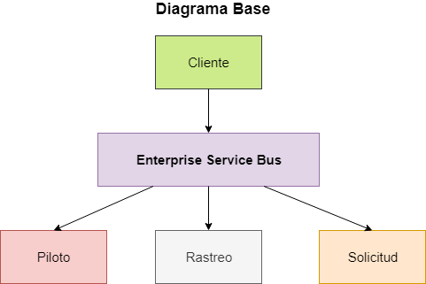

# Software Avanzado
## Tarea 2, Tarea 3

# Arquitectura
- La aplicación está conformada por 3 servicios: `Solicitud`, `Piloto`, `Rastreo`. 
- Estos servicios a su vez se comunican con el _Enterprise Service Bus_ (ESB) el cual es el encargado de hacer uso de los servicios para resolver las peticiones hechas.
- Existe un cliente que se comunica exclusivamente con el _ESB_ para procesar las peticiones.



# Video Explicativo
[Link Youtube](https://youtu.be/XbtOCrq9S6A)

# Servicios Disponibles
## Solicitud
#### Funcionalidad
Recibe como parámetro una ubicación y devuelve la cantidad de viajes que existen en cada ruta
#### Clases
- __recibirSolicitud__: contiene toda la lógica para consultar las rutas disponibles.
- __ruta__: es una clase que contiene toda la informacion de cada ruta o viaje.
#### Comunicación
Este servicio envía y recibe datos del _ESB_.
#### No de puerto
Puerto: 301

## Piloto
#### Funcionalidad
Recibe como parámetro una ubicación y devuelve los datos de algún piloto que se encuentre en esa ubicación.
#### Clases
- __avisoPiloto__: contiene toda la lógica para avisar al piloto del nuevo viaje y mandar los datos al cliente que está pidiendo el Uber. 
- __piloto__: es una clase que contiene toda la informacion relacionada con un piloto.
#### Comunicación
Este servicio envía y recibe datos del _ESB_.
#### No de puerto
Puerto: 302

## Rastreo
#### Funcionalidad
Recibe como parámetro el identificador del piloto y envía de vuelta la información sobre la ubicación del vehículo, para que el usuario sepa la placa, modelo y más.
#### Clases
- __ubicarAuto__: contiene toda la lógica para mandar los datos del vehículo y conductor al cliente que está pidiendo el Uber. 
- __auto__: es una clase que contiene toda la informacion relacionada con un el vehículo.
#### Comunicación
Este servicio envía y recibe datos del _ESB_.
#### No de puerto
Puerto: 303

# Enterprise Service Bus
#### Funcionalidad
Recibe como parámetro una ubicación y devuelve todos los datos del viaje.
#### Clases
- __pedirUber__: contiene toda la lógica para consultar las rutas de viaje, determinar si existen, consultar los datos del piloto de esa ruta y por último mandar los datos del auto que se usará en el viaje.
#### Comunicación
Se comunica con todos los servicios y clientes.
#### No de puerto
Puerto: 300


# Ejecutar Servicios
* Sin _daemon_
```
cd Solicitud
node recibirSolicitud.js
```
* Con _daemon_
```
nodemon recibirSolicitud.js
```

# Otra información
* Instalar Express
```
npm install --save express
```
* Instalar Axios
```
npm install --save axios
```

# Recursos utilizados
* * Create A Microservice-based Web Application: [Link Youtube](https://www.youtube.com/playlist?list=PLDmvslp_VR0xZGhJHMjy5dozCDJYZK6W-)
* * Tutorial Express.js [Link TutorialsPoint](https://www.tutorialspoint.com/expressjs/expressjs_url_building.htm)
* * Tutorial Imports Exports [Link Tutorial](https://adrianmejia.com/getting-started-with-node-js-modules-require-exports-imports-npm-and-beyond/)
* * Tutorial Requests Sincronas [Link StackOverflow](https://stackoverflow.com/questions/46347778/how-to-make-axios-synchronous/46347906)
* * Documentacion Express.js [Link Express JS](https://expressjs.com/en/4x/api.html#app.listen)