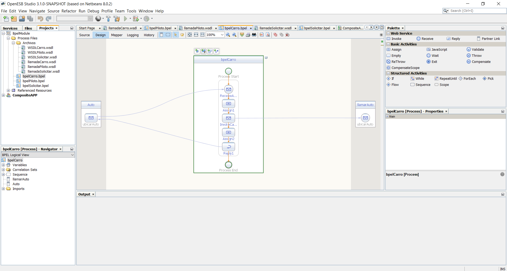

# Software Avanzado
## Tarea 4

Se utilizó BPEL con OPEN-ESB para esta tarea. Los contenidos se encuentran en la Carpeta `ESB_BPEL_JAVA`

https://youtu.be/pH-Saz28UgE - link explicación! \
[Video Youtube](https://youtu.be/pH-Saz28UgE)

BPEL: 

OpenESB: 